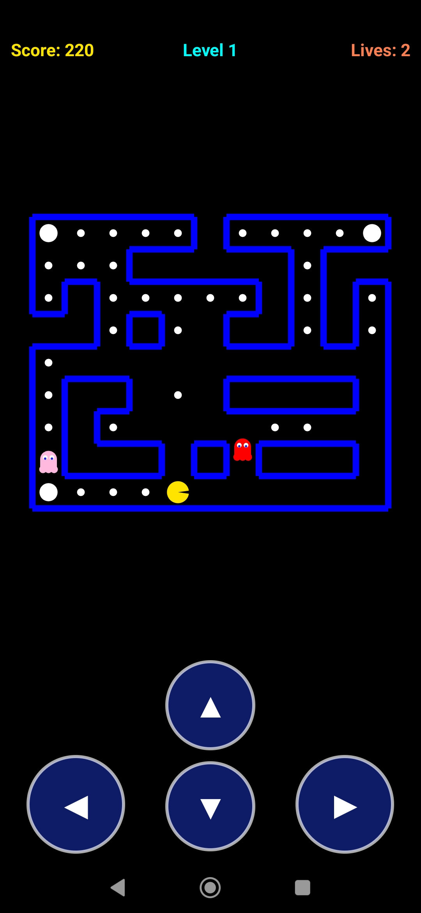

# PacMania

A small Android clone of **Pac-Man**.

Pac-Man is steered through a procedurally-generated maze using on-screen buttons. 
Eat every dot (and the big power dots) to clear the level; each level grows the maze and adds more ghosts.

## Screenshot


## Controls

- **On-screen D-pad** at the bottom of the screen:
  - Bottom-left corner: **← Left**
  - Bottom-right corner: **→ Right**
  - Center (stacked): **▲ Up** on top, **▼ Down** below.
  - Hold a direction to run; release to stop.
- Tap anywhere on the **Game Over** screen to restart.

## Features

- Classic Pac-Man look: yellow Pac-Man with a chomping mouth, blue walls, white dots on a black background.
- Walls are rendered as **thin blue lines** so Pac-Man and the ghosts always stay clearly inside the corridors.
- Procedurally generated maze (recursive backtracker):
  - Level 1 is small and easy with **2 ghosts**.
  - Each level increases the maze size and the number of ghosts (up to 8).
- Power pellets: eat one to turn ghosts blue, then eat them for bonus points before they recover.
- **Yellow diamonds** are scattered around the maze (3 on level 1, up to 6 on later levels). Eating one grants an **extra life** and +100 points. They don't count toward the dots needed to clear a level.
- Secret cheat: tap the **"Lives"** text in the top-right corner **three times** to set lives to **99**.
- **Scatter / chase** ghost AI with alternating behavior phases, so Pac-Man has plenty of room to escape.
- **Warp tunnels** appear on later levels (horizontal from level 3, vertical from level 6) — drive through one side and emerge on the other.
- Background chiptune music plays while you play.

## Build

### Prerequisites

- Android Gradle Plugin 8.3.2 / Gradle 8.4
- Android SDK Platform 34 (and build-tools 34.0.0)
- JDK 17
- `ANDROID_HOME` pointing at your SDK

### Build the debug APK

```bash
./gradlew :app:assembleDebug
```

The APK is placed at:

```
app/build/outputs/apk/debug/pacmania.apk
```

Install on a connected device/emulator:

```bash
adb install -r app/build/outputs/apk/debug/pacmania.apk
```

## Project layout

```
app/
  src/main/
    AndroidManifest.xml
    java/com/pacmaniagame_app/
        MainActivity.java        # HUD + button wiring
        GameView.java            # game loop, maze, movement, AI, rendering
    res/
        layout/activity_main.xml
        values/  strings.xml, themes.xml
        drawable/  control_btn.xml, ic_launcher.xml
        raw/  pac_music.wav      # generated chiptune loop
```

## Design notes

- The game uses a single custom `View` and a manual game loop driven by `postInvalidateOnAnimation()`. There are **no third-party dependencies** or game engines.
- Movement is tile-based: every entity occupies a floor tile and only steps into adjacent open tiles.
- The music asset (`app/src/main/res/raw/pac_music.wav`) is a short original chiptune loop; it can be regenerated with the bundled Python synthesizer if desired.

## About

Made with joy and Prime Agent with Deepseek Flash.
This is a "Zero Code" project fully generated by AI.
You can hire me.
